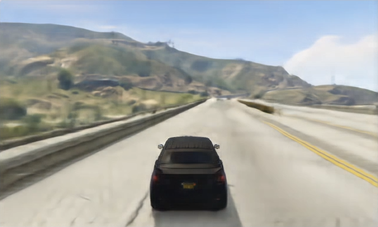
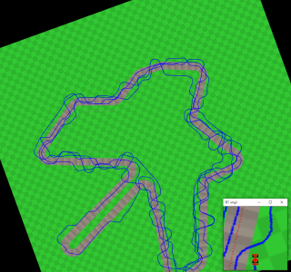

# Description

GANTheftAuto is a fork of the Nvidia's [GameGAN](https://nv-tlabs.github.io/gameGAN/), which is research focused on emulating dynamic game environments. The early research done with GameGAN was with games like Pacman, and we aimed to try to emulate one of the most complex environments in games to date with Grand Theft Auto 5.

# Video
(click to watch)

[](https://www.youtube.com/watch?v=udPY5rQVoW0)


GANTheftAuto focuses mainly on the Grand Theft Auto 5 (GTA5) game, but contains other environments as well. In addition to the original project, we provide a set of improvements and fixes, with the most important ones being:
- ability to use the newest PyTorch version, which as of now is 1.8.1
- ability to use non-square images (16:8 in our case)
- larger generator and discriminator models
- ability to use more than 2 generators
- inference script (which is absent in the GameGAN repository)
- ability to use upsample model with inference
- ability to show generator outputs live during training (training preview) (soon with one of the future commits)

The work is still in progress as we know that our results can be greatly improved still.


GANTheftAuto output on the left, upscaled 4x for better visibility, and upsampled output (by a separate model) 


# Playable demo

You can instantly run the demo:
 - Download and unzip or clone this repository:
   ```
   git clone https://github.com/Sentdex/GANTheftAuto.git
   cd GANTheftAuto
   ```
 - Install requirements
   
   Install (the highest) CUDA version of PyTorch following instructions at [PyTorch's website](https://pytorch.org/) (there is no universal command to do so). ROCm and CPU versions are currently not supported by the project.
   ```
   pip3 install -r requirements.txt
   pip3 install tensorflow-gpu tensorflow_addons
   ```
 - Run inference:
   ```
   ./scripts/gtav_inference_demo.sh
   ```
   or
   ```
   scripts\gtav_inference_demo.bat
   ```

We are providing one of our trained models on GTA5 data as well as an 8x upsample model (part of a separate project). There's no GTA V running, this is the actual GAN output of a human playing within the GAN environment. 

Example actual output of these demo models:



# Trainable demo

Since we cannot share out data collecting script, which involves a GTA5 mod and python code, we are sharing a sample dataset which you can use to train your model on. It's included within the `data/gtav/gtagan_2_sample` folder.

To train your own model, follow the steps above, but run a training script instead.

- Run training: 
   ```
   ./scripts/gtav_multi_demo.sh
   ```
   or
   ```
   scripts\gtav_inference_demo.bat
   ```

You'll need a GPU with at least 8 GB of VRAM.

Batch size in the demo scripts is currently set to `1`. If you have 16 GB of VRAM or more, try to find the biggest batch that you can fit in your GPU(s).


# General

## Environment Setup
- Download and unzip or clone the repository
  ```
  git clone https://github.com/Sentdex/GANTheftAuto.git
  cd GANTheftAuto
  ```
- Install dependencies
  
  Install (the highest) CUDA version of PyTorch following instructions at [PyTorch's website](https://pytorch.org/) (there is no universal command to do so). ROCm and CPU versions are currently not supported by the project.
  ```
  pip3 install -r requirements.txt
  ```

## Dataset extraction

Currently, GTA V, Vroom and Cartpole are the only implemented data sources.

### GTA V environment

This is an environment created using Grand Theft Auto V. We created our own GTA5 mod accompanied by a Python script to collect the data. It contains a simple driving AI (which we named DumbAI ;) ). We are pulling road nodes from the game and apply math transformations to create paths, then we are spawning multiple cars at the same time and alternate them to pull multiple streams at the same time (to speedup training). Game mod accepts steering commands from the Python script as well as limits the speed and sets other options like weather, traffic, etc. Python script analyzes current car position and nearest road nodes to drive using different paths to cover all possible actions and car positions as best as possible. This is important for further seamless experience with player "playing" the environment - it needs to output coherent and believable images.

Data collecting demo with visible road nodes (not included in the final training data):
[](https://www.youtube.com/watch?v=kV86KMNE-Ew)

(click to watch on YouTube)

As mentioned above, we can't share our data collecting scripts, but we are providing sample dataset. If you believe you have a model that has interesting results, feel free to reach out and we may try to train it on the full dataset.

You can also create your own dataset by recording frames and actions at 10 FPS. Save format is gzipped pickle file containing a dictionary of `'actions'` and `'observations'`. Actions are a single-dimensional NumPy array of `0` (left), `1` (straight) and `2` (right), while observations are a four-dimensional array where the first dimension are samples, and the other are `(48, 80, 3)` - RGB image size. Ungzip and unpickle example sample from the sample dataset to learn more about the data structure. Each file should contain a single sequence length of at least 32 frames.

Example train script is available at `scripts/gtav_multi.sh` (as well as its `.bat` version).    

### Vroom environment

Vroom is our own environment based on the OpenmAI Gym's Box2D CarRacing environment, but this one does not require Gym to run. Its only dependencies are OpenCV and NumPy.

Example track with a slice of what's actually saved as a training data:



(blue, red and purple lines are shown for visualization purposes only and are not a part of the training data)

Example model output (we've never hunted for best possible output and switch to GTAV instead):


We are including the data collecting script - a simple AI (DumbAI) is playing the environment to collect the data. The car is "instructed" to follow the road, with additional constantly changing offset from the center of teh road, turns and u-turns to cover all possible scenarios.

To run the data collector: 
- Install dependencies
  ```
  cd data/vroom
  pip3 install - requirements.txt
  ```
- Edit `collect_data.py` if you need to change any defaults
- Run the data extraction
  ```
  python3 collect_data.py
  ```

### NEAT-Cartpole

This environment is created with OpenAI Gym's Cartpole. However, the data collecting part is unattended as we are first training the NEAT algoritm to play it, then collect data generated this way.

Warning: recently we've discovered a possible issue with this environment causing actions to alternate between a direction and no action. As for now we have no fix for this environment, so your model results are highly likely to not be very useful. We'd recommend trying to build your own agent to play cartpole instead of a NEAT bot. 

To run the data collector: 
- Install dependencies
  ```
  cd data/cartpole
  pip3 install - requirements.txt
  ```
- Edit `neat_cartpole.py` and update constants (at the bottom of the script) to your needs
- Run the data extraction
  ```
  python3 neat_cartpole.py
  ```


## Training
We provide training scripts in './scripts'.

### GTA V
- For training the full GameGAN model, run:
  ```
  ./scripts/gtav_multi.sh
  ```

### Vroom
- For training the full GameGAN model, run:
  ```
  ./scripts/vroom_multi.sh
  ```

### NEAT-Cartpole
- For training the full GameGAN model, run:
  ```
  ./scripts/cartpole_multi.sh
  ```

## Monitoring
- You can monitor the training process with tensorboard:
  ```
  tensorboard --logdir=./results
  ```

## Inference
Inference is currently unfinished - can be ran, but actions are randomly generated instead of taken from the user input. We'll finish it up shortly.

### Vroom
Edit `scripts/gtav_inference.sh` and update the model filename, then run:
  ```
  ./scripts/gtav_inference.sh
  ```

### Vroom
Edit `scripts/cartpole_inference.sh` and update the model filename, then run:
  ```
  ./scripts/cartpole_inference.sh
  ```

### NEAT-Cartpole
Edit `scripts/cartpole_inference.sh` and update the model filename, then run:
  ```
  ./scripts/cartpole_inference.sh
  ```


------
## Parts of the Original Nvidia's GameGAN readme
(head to the [GameGAN](https://github.com/nv-tlabs/GameGAN_code) for a full version)

This part describes the VidDom environment which we did not use in our work. The repository also contains Pac Man environment which have been never described and no data collection scrpts were provided. 

## Dataset extraction
Please clone and follow https://github.com/hardmaru/WorldModelsExperiments/tree/master/doomrnn to install the VizDoom environment.
- Copy extraction scripts and run
```
cp data/extract.py DOOMRNN_DIR/
cp data/extract_data.sh DOOMRNN_DIR/
cd DOOMRNN_DIR
./extract_data.sh
```
- Now, extracted data is saved in 'DOOMRNN_DIR/vizdoom_skip3'
```
cd GameGAN_code/data
python dataloader.py DOOMRNN_DIR/vizdoom_skip3 vizdoom
```
- You should now see .npy files extracted in 'data/vizdoom' directory.

For custom datasets, you can construct .npy files that contain a sequence of image and action pairs and define a dataloader similar to 'class vizdoom_dataset'. Please refer to 'data/dataloder.py'.

-- The above repository is deprecated and VizDoom environment might not run correctly in certain systems. In that case, you can use the docker installtaion of https://github.com/zacwellmer/WorldModels and copy the extraction scripts in the docker environment. 


## Training
We provide training scripts in './scripts'.

- For training the full GameGAN model, run:
```
./scripts/vizdoom_multi.sh
```

- For training the GameGAN model without the external memory module, run:
```
./scripts/vizdoom_single.sh
```

## Monitoring
- You can monitor the training process with tensorboard:
```
tensorboard --port=PORT --logdir=./results
```


#### Tips
- Different environments might need different hyper-parameters. The most important hyper-parameter is 'recon_loss_multiplier' in 'config.py', which usually works well with 0.001 ~ 0.05.
- Environments that do not need long-term consistency usually works better without the external memory module
